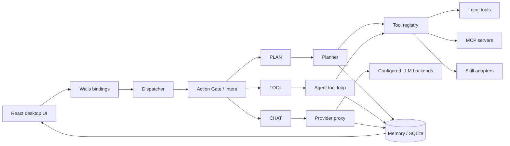

# leiAgent

**A local-first desktop Agent runtime built with Go, Wails, and React.**

leiAgent 不只是聊天 UI。它把一次用户请求路由到 `CHAT`、`PLAN` 或 `TOOL` 执行路径，并在同一个桌面应用中组合多模型故障转移、Agent 工具循环、MCP、Skills、持久化记忆、工作区文件和人工审批。

> Local-first 指 Agent 运行时、会话数据、记忆和工具执行位于本机；模型请求仍会发送到你配置的 LLM 服务。

## 核心能力

| 方向 | 实现 |
| --- | --- |
| 请求调度 | Action Gate + 意图识别，将请求分流到 `CHAT` / `PLAN` / `TOOL` |
| Agent runtime | 工具调用循环、执行上下文、任务取消、流式事件和多 Agent 会话 |
| 规划执行 | Planner 生成步骤、调用工具、校验结果并持久化计划状态 |
| 工具生态 | 内置文件、Shell、搜索、时间、文库、长文和定时任务工具；支持 MCP 与 Skills |
| 模型接入 | OpenAI Chat Completions 兼容接口、Gemini 转换层、多后端顺序故障转移 |
| 长期上下文 | SQLite 会话、YAML 本地记忆、规则压缩、结构化用户画像和备忘录 |
| 桌面体验 | 多会话、流式消息、文库、Agent 管理、定时任务和可视化设置 |

## 架构



一次请求的主要执行过程：

1. React 通过 Wails binding 提交消息，Dispatcher 按会话串行处理。
2. Action Gate 先识别可直接回答的普通对话；需要动作时进入完整意图识别。
3. Dispatcher 构造执行蓝图。对“今天 / 最新 / 当前”等时效请求，会先取得服务器时间锚点并要求结果标注 as-of 时间。
4. `CHAT` 直接走 Provider；`PLAN` 由 Planner 生成并执行步骤；`TOOL` 进入 Agent 工具调用循环。
5. 响应、工具结果和压缩上下文写入记忆层，再通过流式事件返回桌面端。

主要后端模块：

```text
internal/
├── dispatcher/       # Action Gate、意图路由、执行策略
├── agent/            # Agent 工具调用循环
├── planner/          # 计划生成、步骤执行与结果校验
├── tools/            # 内置工具与统一 registry
├── MCP/              # MCP client、配置、预检和环境解析
├── openclawskill/    # Skill 扫描、依赖和生命周期
├── memory/           # 上下文、压缩存储与 SQLite memory
├── provider/         # OpenAI-style / Gemini 协议模型
├── proxy/            # LLM 配置、故障转移和响应处理
├── bashpolicy/       # Shell 命令策略
├── shellapproval/    # 用户批准 / 拒绝握手
├── doclib/           # Workspace 文库边界
└── profile/          # 结构化用户画像
```

前端按功能组织在 `frontend/src/features/`，通用组件、状态、服务和样式分别位于 `components/`、`stores/`、`services/` 与 `styles/`。

## 工具安全边界

Agent 工具不是直接裸调用本机能力，关键边界包括：

| 边界 | 行为 | 证据 |
| --- | --- | --- |
| MCP allowlist | `allowed_tools` 必须显式列出；缺失或空列表默认拒绝调用 | `internal/MCP/client.go`、`client_test.go` |
| Workspace 写入 | 文件写入和下载路径必须解析在 `workspace/` 内 | `internal/tools/filefunctions/`、`filefunctions_test.go` |
| Shell policy | 命令先经过结构限制和可配置黑名单 | `internal/bashpolicy/` |
| 人工审批 | Shell 可阻塞等待桌面端允许或拒绝，并校验会话与 request ID | `internal/shellapproval/` |
| 配置隔离 | 本地 `config/config.yaml` 和运行时数据不进入 Git | `.gitignore`、`config/config.example.yaml` |
| 发布预检 | 扫描疑似密钥、运行测试并执行完整 Wails 构建 | `scripts/release-check.sh` |

这些限制降低了误调用风险，但不等于安全沙箱。运行第三方 MCP 或 Skill 前仍应检查其源码、权限和网络行为。

## 快速开始

### 环境要求

- Go `1.26`（以 `go.mod` 为准）
- Node.js `22`（与 CI 对齐）
- Wails CLI `v2.12.0`
- 对应平台的 Wails / WebView 系统依赖

### 开发运行

```bash
git clone git@github.com:xumi30/leiAgentAPP.git
cd leiAgentAPP

go install github.com/wailsapp/wails/v2/cmd/wails@v2.12.0
./scripts/install-deps.sh
wails dev
```

首次启动后可在“设置”中配置 LLM。也可以复制示例配置后编辑：

```bash
cp config/config.example.yaml config/config.yaml
```

真实 API Key 只应保存在被忽略的 `config/config.yaml`，或通过 `LEIAGENT_LLM_API_KEY` 等环境变量注入。多后端、Gemini、MCP、Skills、记忆压缩和 Shell 策略示例均在 `config/config.example.yaml` 中。

### 构建

```bash
wails build -clean
```

平台发布脚本：

```bash
npm run build:release                         # macOS
./scripts/build-release-linux.sh --webkit2-41 # Ubuntu 24.04+
./scripts/build-release.ps1                   # Windows PowerShell
```

`frontend/wailsjs/` 是 Wails 生成且不提交的 binding。干净克隆后应先运行 `wails dev` 或 `wails build -clean`，不要直接把缺少 binding 的前端构建失败误判为 React 问题。

## 测试与 CI

本地快速验证：

```bash
go test ./...
cd frontend && npm run build
```

完整发布前检查：

```bash
npm run release:check
```

当前测试覆盖 MCP 默认拒绝、环境解析、Shell policy 与审批、Workspace 路径边界、Agent Skill 预检、Dispatcher 意图与执行蓝图、记忆压缩、SQL memory、Provider 配置和 Proxy-LB 等关键路径。

CI 会在 Pull Request 和 `main` push 上运行 Go 全量测试及 Linux Wails smoke build；`v*` tag 会触发 Linux、Windows、macOS 构建并生成 GitHub Release 产物。

## 数据与配置

开发模式下数据位于仓库运行根目录；安装后的应用会使用系统用户配置目录下的 `leiAgent` 目录。主要本地数据包括：

- `config/config.yaml`：LLM、MCP、Skill 环境和安全策略
- `data/`：SQLite 会话与备忘录
- `workspace/`：允许工具读写的用户工作区
- `localmemory/`、`compress/`：对话上下文与压缩产物
- `profiles/`：结构化用户画像
- `logs/`：运行日志

这些目录包含私密数据，不应提交到版本库。

## 进一步阅读

- [完整功能说明](docs/product-features.md)
- [发布准备与安全清单](docs/release-readiness.md)
- [备忘录文档入口](docs/memo-features.md)

## 当前工程重点

项目已经具备完整 Agent runtime 的主要纵向能力。当前维护重点是继续拆分复杂 UI / façade、加强 Planner 与 Agent orchestration 集成测试，以及补齐签名、公证、隐私说明和安装验证。详见 [Release readiness](docs/release-readiness.md)。
